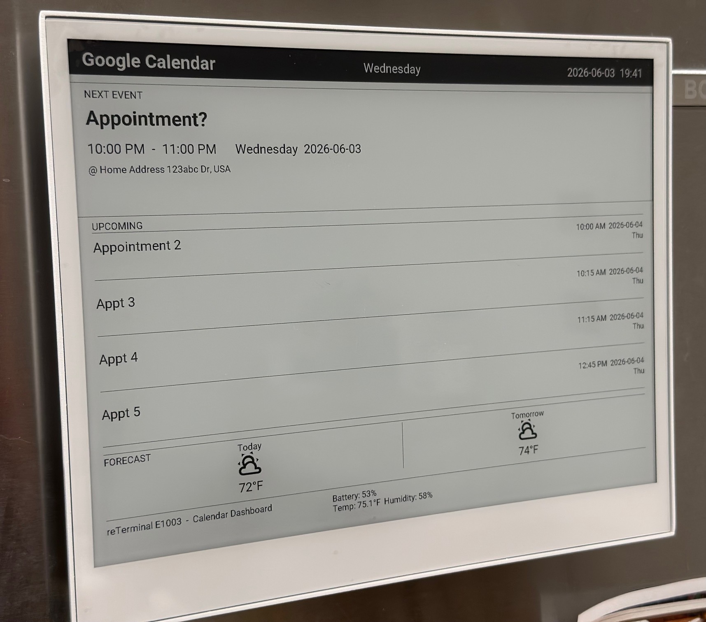

# reTerminal E1003 – ESPHome Dashboard – Power Savings Optimized

A Google Calendar dashboard for the [Seeed reTerminal E1003](https://www.seeedstudio.com/reTerminal-E1003-p-6731.html) — a great all-in-one 10.3" e-ink display with a built-in ESP32-S3, 3000mAh battery, SHT4x sensor, and physical buttons. This project is intended as a starting point for running ESPHome on the E1003, and is designed to be straightforward to adapt to your own calendar and data sources.

The primary motivation for publishing this project is to document deep sleep power optimizations that dramatically extend battery life. Out of the box, a stock ESPHome setup on this device draws ~185mA during the awake idle state and 4–5mA during deep sleep — resulting in a real-world battery life of roughly 20–30 days. Through active hardware-in-the-loop testing, the deep sleep current was reduced to below the detection limit of a BM235 multimeter, with the goal of approaching Seeed's advertised upper limit of 6 months (potentially more, depending on your update interval).

This project was built with inspiration from several community projects (credited below) and optimized through active testing with Claude. If you prefer not to use AI-assisted code, the key power-related findings are documented in the [Power](#power) section below and can be adopted independently into any ESPHome configuration for this device.

## Features

- Google Calendar display: current/next event + 4 upcoming events
- 2-day weather forecast with MDI weather icons
- SHT4x temperature and humidity
- Battery voltage and percentage (calibrated curve)
- Deep sleep between updates — measured sleep current <100 µA
- Estimated 6-8 month battery life
- Wake on button press (GPIO4, center white button)
- OTA-friendly "Hold Awake" button in Home Assistant

<p align="center">
  
</p>

## Hardware

| Component | Details |
|---|---|
| Board | [Seeed reTerminal E1003](https://www.seeedstudio.com/reTerminal-E1003-p-6731.html) |
| MCU | ESP32-S3 |
| Display | 10.3" e-ink, IT8951 controller, 1404×1872 |
| Display driver | [koosoli community driver](https://github.com/koosoli/Seeed-10.3-inch-IT8951-ESPHome-Drivers) |
| Battery | 3000mAh Li-ion (built-in) |
| Temp/humidity | SHT4x (I2C 0x44) |

### Mounting

Mounts to a fridge (or any steel surface) using:

- 4× [DIYMAG Heavy Duty Cup Magnets, 60LBS, 0.98" with countersunk hole](https://www.amazon.com/s?k=DIYMAG+Heavy+Duty+Magnets+60LBS+Neodymium+Round+Base+Cup+Countersunk+0.98+Inch) — screwed into the rear of the device enclosure
- 4× M3×10mm screws

### Key GPIO assignments (schematic v1.0)

| GPIO | Function | Notes |
|---|---|---|
| 40 | VBAT_EN | Battery ADC divider enable |
| 21 | ITE_VCC_EN | Managed by koosoli driver — do not redefine |
| 39 | SD_EN | SD card load switch |
| 48 | TOUCH_RES | GT911 touch reset, active-low |
| 11 | EPD_Drive_EN | E-paper drive enable |
| 38 | PDM_EN | PDM mic enable |
| 45 | BUZZER_EN | Buzzer enable |
| 16 | USER_LED | Active-LOW (excluded from sleep hold set) |
| 4 | Center button | Wake source, external 10K pull-up (R37) |
| 3 | Green left button | — |
| 5 | Left white button | — |
| 1 | Battery ADC | — |

## Power

**Sleep current:** below 100µA — undetectable with current measurement setup (BM235 multimeter reads 0.00 on both mA and µA ranges)  
**Awake idle:** ~185mA; wake cycle ~20s  
**4h interval estimated life:** 60+ days (projected from early drain test data; ongoing)

The critical fix was using `gpio_hold_en()` + `gpio_deep_sleep_hold_en()` to latch GPIO states into the sleep domain. Without holds, bare `digitalWrite()` calls are silently discarded at sleep entry on the ESP32-S3, leaving GPIO39 (SD) and GPIO48 (touch) floating HIGH and burning ~4.95mA.

GPIO16 (USER_LED) is intentionally **excluded** from the hold set — latching it LOW drives the green LED on during sleep via the Q4 transistor.

`ext1 ANY_LOW` is used for wake instead of `ext0` because `gpio_deep_sleep_hold_en()` breaks ext0 wake on the S3.

## Files

| File | Destination | Purpose |
|---|---|---|
| `reterminal-e1003-calendar.yaml` | ESPHome config dir | ESPHome device configuration |
| `secrets.yaml.example` | ESPHome config dir | Template for required secrets |
| `automations.yaml` | Merge into HA `automations.yaml` | Weather fetch + calendar sync automations |
| `configuration.yaml` | Merge into HA `configuration.yaml` | input_text helpers + template sensors |
| `update_weather_forecast.py` | `/config/python_scripts/` | Parses forecast API response → input_text helpers |

## Setup

### 1. ESPHome secrets

Copy `secrets.yaml.example` to `secrets.yaml` in your ESPHome config directory and fill in your values.

### 2. Material Design Icons font

Download `materialdesignicons-webfont.ttf` from the [MDI releases](https://github.com/Templarian/MaterialDesign-Webfont/releases) and place it at `fonts/materialdesignicons-webfont.ttf` alongside your ESPHome YAML.

### 3. Home Assistant — configuration.yaml

Merge the `input_text` and `template` blocks from `configuration.yaml` into your HA `configuration.yaml`. Also ensure `python_script:` is present at the top level (enables the `/config/python_scripts/` directory).

### 4. Home Assistant — python script

Copy `update_weather_forecast.py` to `/config/python_scripts/update_weather_forecast.py` on your HA instance.

The script hardcodes `weather.home` as the weather entity key. If your weather entity has a different name, update line 7:
```python
weather_forecast = forecast_data.get('weather.home', {}).get('forecast', None)
```

Temperature values are stored as pre-formatted strings (e.g. `"72°F"`) directly from your HA weather entity. The display renders them as-is with no unit conversion.

### 5. Home Assistant — automations

Add the two automations from `automations.yaml` to your HA automations (via the UI or by merging into `automations.yaml`):

- **Weather Updating** — fetches daily forecast every 2 hours and on HA start, calls the python script to populate the `input_text` helpers
- **Sync Calendar Events to ESPHome** — polls your calendar every 15 minutes and writes events 2–5 into `input_text` helpers (event 1 comes directly from the calendar entity attribute)

### 6. Customize entity IDs

Two places need updating to match your setup:

| What | File | Location |
|---|---|---|
| Calendar entity | `reterminal-e1003-calendar.yaml` | `substitutions.calendar_entity` |
| Calendar entity | `automations.yaml` | `Sync Calendar Events` trigger + actions |
| Weather entity | `update_weather_forecast.py` | Line 7 (`weather.home`) |

### 7. Flash

Initial flash via USB-C. Subsequent OTA updates: wake the device via the center button (GPIO4), then press **Hold Awake (OTA)** in HA within the brief awake window before `run_duration` (60s) expires.

## Sleep interval

`sleep_duration` is set to `4h`. Adjust to taste — `6h` is a reasonable default for a wall calendar.

## License

MIT

## Acknowledgements

- **[Incipiens/Adam-Home-Assistant-Snippets](https://github.com/Incipiens/Adam-Home-Assistant-Snippets/tree/main/ESPHome/reTerminal%20E1003%20-%20Touch%20controls)** — original ESPHome YAML for the reTerminal E1003, used as the starting point for this project
- **[techdregs/E-Paper-DashBoard](https://github.com/techdregs/E-Paper-DashBoard)** — the triggered template pattern in `Forecast.yaml` (hourly + daily `weather.get_forecasts` sensors) is derived from this project
- **[Madelena/esphome-weatherman-dashboard](https://github.com/Madelena/esphome-weatherman-dashboard)** — the original ESPHome e-ink weather dashboard that inspired techdregs and much of the broader community
- **[Seeed Studio reTerminal E10xx ESPHome Advanced Guide](https://wiki.seeedstudio.com/reterminal_e10xx_with_esphome_advanced/)** — battery voltage calibration curve
- **[koosoli](https://github.com/koosoli/Seeed-10.3-inch-IT8951-ESPHome-Drivers)** — community ESPHome driver for the IT8951-based reTerminal E1003 display
